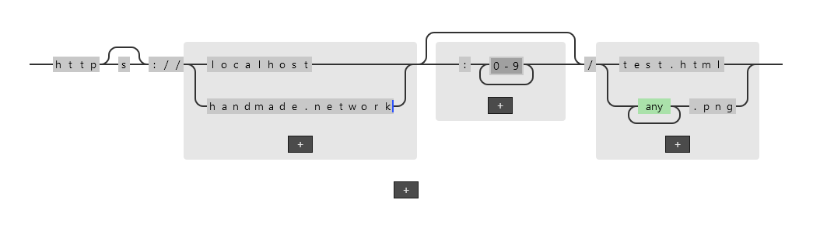

# Regular Express

A tool that allows you to build regular expressions completely visually. Use the power of regular expressions without getting bogged down by the syntax!

View the [task tracker](https://www.notion.so/bvisness/3708fea1fb9d43f1b51b7512d685f963?v=c0b80b9cebc843f5b95dac1370bfa76b) to see what's in the works.
